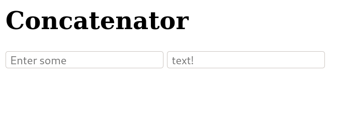
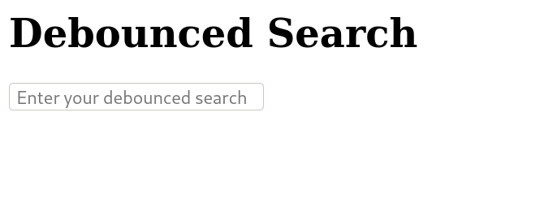
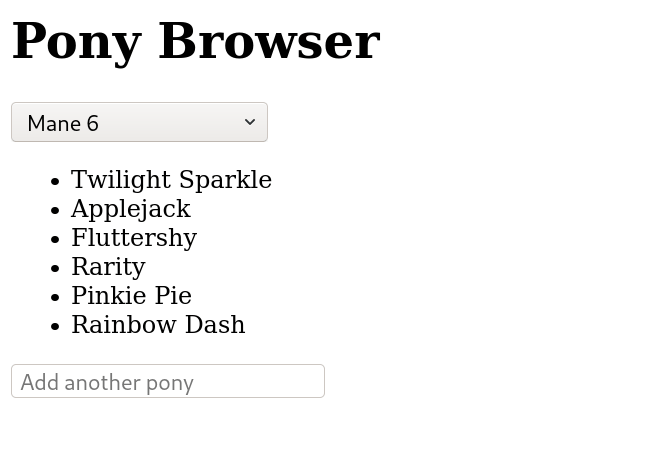

<p>
  <a href="https://www.npmjs.com/package/patella">
    
  </a>
  <a href="https://www.npmjs.com/package/patella?activeTab=dependencies">
    
  </a>
  <a href="https://github.com/luawtf/Patella/blob/master/lib/patella.d.ts">
    
  </a>
  <a href="https://bundlephobia.com/result?p=patella">
    
  </a>
  <a href="https://github.com/luawtf/Patella/actions">
    
  </a>
  <a href="https://coveralls.io/github/luawtf/Patella">
    
  </a>
  <a href="https://github.com/luawtf/Patella/blob/master/LICENSE">
    
  </a>
</p>

# Patella &#x1F501;
Patella, formerly known as Luar, is a library for <a href="https://wikipedia.org/wiki/Reactive_programming">reactive programming</a> in JavaScript, inspired by [Hyperactiv](https://github.com/elbywan/hyperactiv) and [Vue.js](https://vuejs.org/).

Jump to one of:
  - [Installation](#installation)
  - [Usage](#usage)
  - [Examples and Snippets](#examples-and-snippets)
  - [Pitfalls](#pitfalls)
  - [API](#api)
  - [Authors](#authors)
  - [License](#license)

## Installation
Patella is available via [npm](https://www.npmjs.com/package/patella):
```sh
$ npm install patella
```
```javascript
// ECMAScript module environments
import { observe, ignore, computed, dispose } from "patella";
// CommonJS environments
const { observe, ignore, computed, dispose } = require("patella");
```

Or, for people working without a bundler, it can be included from [UNPKG](https://www.unpkg.com/browse/patella@latest/):
```html
<script src="https://www.unpkg.com/patella"></script>
<script>
  Patella.observe({});
  Patella.ignore({});
  Patella.computed(function () {});
  Patella.dispose(function () {});
</script>
```

Various other builds of Patella are available in the [dist](./dist) folder including sourcemaps and minified versions.
Minification is performed using both [Terser](https://github.com/terser/terser) and [UglifyJS](https://github.com/mishoo/UglifyJS) using custom configurations designed for a balance of speed and size (Patella is a microlibrary at 900~ bytes gzipped).

## Usage
Patella provides functions for observing object mutations and acting on those mutations automatically.
Possibly the best way to learn is by example, so let's take a page out of [Vue.js's guide](https://vuejs.org/v2/guide/events.html) and make a button that counts how many times it has been clicked using Patella's `observe(object)` and `computed(func)`:
```html
<h1>Click Counter</h1>
<button onclick="model.clicks++"></button>
<script>
  const $button = document.getElementsByTagName("button")[0];
  const model = Patella.observe({
    clicks: 0
  });
  Patella.computed(() => {
    $button.innerText = model.clicks
      ? `I've been clicked ${model.clicks} times`
      : "Click me!";
  });
</script>
```
<br>
View the [full source](./examples/counter.html) or [try it on JSFiddle](https://jsfiddle.net/luawtf/hL6g4emk/latest).

Notice how in the above example, the `<button>` doesn't do any extra magic to change it's text when clicked, it just increments the model's click counter, which is "connected" to the button's text in the computed function.

Now let's try doing some math, here's a snippet that adds and multiplies two numbers:
```javascript
const calculator = Patella.observe({
  left:    1,
  right:   1,
  sum:     0,
  product: 0
});

// Connect left, right -> sum
Patella.computed(() => calculator.sum     = calculator.left + calculator.right);
// Connect left, right -> product
Patella.computed(() => calculator.product = calculator.left * calculator.right);

calculator.left = 2;
calculator.right = 10;
console.log(calculator.sum, calculator.product); // Output: 12 20

calcuator.left = 3;
console.log(calculator.sum, calculator.product); // Output: 13 30
```
Pretty simple, right?
Patella's main goal is to be as simple as possible, you only need 2 functions to build almost anything.

## Examples and Snippets
Jump to one of:
  - [Concatenator](#concatenator)
  - [Debounced Search](#debounced-search)
  - [Pony Browser](#pony-browser)
  - [Multiple Objects Snippet](#multiple-objects-snippet)
  - [Linked Computed Functions Snippet](#linked-computed-functions-snippet)

### Concatenator
```html
<h1>Concatenator</h1>
<input type="text" oninput="model.first = value" placeholder="Enter some"/>
<input type="text" oninput="model.second = value" placeholder="text!"/>
<h3 id="output"></h3>
<script>
  const $output = document.getElementById("output");
  const model = Patella.observe({
    first: "",
    second: "",
    full: ""
  });
  Patella.computed(() => {
    model.full = model.first + " " + model.second;
  });
  Patella.computed(() => {
    $output.innerText = model.full;
  });
</script>
```
<br>
View the [full source](./examples/concatenator.html) or [try it on JSFiddle](https://jsfiddle.net/luawtf/zvnm4jp7/latest).

### Debounced Search
```html
<h1>Debounced Search</h1>
<input type="text" oninput="model.input = value" placeholder="Enter your debounced search"/>
<h3 id="search"></h3>
<script>
  const $search = document.getElementById("search");

  const model = Patella.observe({
    input: "",
    search: ""
  });

  Patella.computed(() => {
    search.innerText = model.search;
  });

  let timeoutID;
  Patella.computed(() => {
    const input = model.input;
    if (timeoutID) clearTimeout(timeoutID);
    timeoutID = setTimeout(() => {
      model.search = input;
    }, 1000);
  });
</script>
```
<br>
View the [full source](./examples/debounce.html) or [try it on JSFiddle](https://jsfiddle.net/luawtf/abd3qxft/latest).

### Pony Browser
```html
<main id="app">
  <h1>Pony Browser</h1> 
  <select></select>
  <ul></ul>
  <input type="text" placeholder="Add another pony"/>
</main>
<script>
  // Find elements
  const $app = document.getElementById("app");
  const [, $select, $list, $input] = $app.children;

  // Declare model
  const model = Patella.observe({
    /* Truncated, find full source in ./examples/pony.html */
  });

  // Populate <select>
  for (const [value, { name }] of Object.entries(model.characterSets)) {
    const $option = document.createElement("option");
    $option.value = value;
    $option.innerText = name;
    $select.appendChild($option);
  }

  // Connect model.selected.key -> model.selected.current
  Patella.computed(() => {
    model.selected.current = model.characterSets[model.selected.key];
  });

  // Connect model.selected.current.members -> <ul>
  Patella.computed(() => {
    $list.innerHTML = "";
    for (const member of model.selected.current.members) {
      const $entry = document.createElement("li");
      $entry.innerText = member;
      $list.appendChild($entry);
    }
  });

  // Connect <select> -> model.selected.key
  $select.addEventListener("change", () => {
    model.selected.key = $select.value;
  });

  // Connect <input> -> model.selected.current.members
  $input.addEventListener("keyup", ({ key }) => {
    if (key !== "Enter") return;

    const currentSet = model.selected.current;
    currentSet.members = [
      ...currentSet.members,
      $input.value
    ];

    $input.value = "";
  });
</script>
```
<br>
View the [full source](./examples/pony.html) or [try it on JSFiddle](https://jsfiddle.net/luawtf/84wmaz0g/latest).

## Multiple Objects Snippet
```javascript
// Setting up some reactive objects that contain some data about a US president...
// Disclaimer: I am not an American :P
const person = Patella.observe({
  name: { first: "George", last: "Washington" },
  age: 288
});
const account = Patella.observe({
  user: "big-george12",
  password: "IHateTheQueen!1"
});

// Declare that we will output a log message whenever person.name.first, account.user, or person.age are updated
Patella.computed(() => console.log(
  `${person.name.first}'s username is ${account.user} (${person.age} years old)`
)); // Output: George's username is big-george12 (288 years old)

// Changing reactive properties will only run computed functions that depend on them
account.password = "not-telling"; // Does not output (no computed function depends on this)

// All operators work when updating properties
account.user += "3"; // Output: George's username is big-george123 (288 years old)
person.age++; // Output: George's username is big-george123 (289 years old)

// You can even replace objects entirely
// This will automatically observe this new object and will still trigger dependant computed functions
// Note: You should ideally use ignore or dispose to prevent depending on objects that get replaced, see pitfalls
person.name = {
  first: "Abraham",
  last: "Lincoln"
}; // Output: Abraham's username is big-george123 (289 years old)

person.name.first = "Thomas"; // Output: Thomas's username is big-george123 (289 years old)
```

### Linked Computed Functions Snippet
```javascript
// Create our nums object, with some default values for properties that will be computed
const nums = Patella.observe({
  a: 33, b: 23, c: 84,
  x: 0,
  sumAB: 0, sumAX: 0, sumCX: 0,
  sumAllSums: 0
});

// Declare that (x) will be equal to (a + b + c)
Patella.computed(() => nums.x = nums.a + nums.b + nums.c);
// Declare that (sumAB) will be equal to (a + b)
Patella.computed(() => nums.sumAB = nums.a + nums.b);
// Declare that (sumAX) will be equal to (a + x)
Patella.computed(() => nums.sumAX = nums.a + nums.x);
// Declare that (sumCX) will be equal to (c + x)
Patella.computed(() => nums.sumCX = nums.c + nums.x);
// Declare that (sumAllSums) will be equal to (sumAB + sumAX + sumCX)
Patella.computed(() => nums.sumAllSums = nums.sumAB + nums.sumAX + nums.sumCX);

// Now lets check the (sumAllSums) value
console.log(nums.sumAllSums); // Output: 453

// Notice that when we update one value ...
nums.c += 2;
// ... all the other values update! (since we declared them as such)
console.log(nums.sumAllSums); // Output: 459
```

## Pitfalls
__TODO__

## API
<h4 id="observe"><code>function observe(object)</code></h4>
Description:
<ul>
  <li>
    Makes an object and its properties reactive recursively.
    Subobjects (but not subfunctions!) will also be observed.
    Note that <a href="#observe"><code>observe</code></a> does not create a new object, it mutates the object passed into it: <code>observe(object) === object</code>.
  </li>
</ul>
Parameters:
<ul>
  <li><code>object</code> - Object or function to make reactive</li>
</ul>
Returns:
<ul>
  <li>Input <code>object</code>, now reactive</li>
</ul>

<h4 id="ignore"><code>function ignore(object)</code></h4>
Description:
<ul>
  <li>
    Prevents an object from being made reactive, <a href="#observe"><code>observe</code></a> will do nothing.
    Note that <a href="#ignore"><code>ignore</code></a> is not recursive, so subobjects can still be made reactive by calling <a href="#observe"><code>observe</code></a> on them directly.
  </li>
</ul>
Parameters:
<ul>
  <li><code>object</code> - Object or function to ignore</li>
</ul>
Returns:
<ul>
  <li>Input <code>object</code>, now permanently ignored</li>
</ul>

<h4 id="computed"><code>function computed(func)</code></h4>
Description:
<ul>
  <li>
    Calls <code>func</code> with no arguments and records a list of all the reactive properties it accesses.
    <code>func</code> will then be called again whenever any of the accessed properties are mutated.
    Note that if <code>func</code> has been <a href="#dispose"><code>dispose</code></a>d with <code>!!clean === false</code>, no operation will be performed.
  </li>
</ul>
Parameters:
<ul>
  <li><code>func</code> - Function to execute</li>
</ul>
Returns:
<ul>
  <li>Input <code>func</code></li>
</ul>

<h4 id="dispose"><code>function dispose(func, clean)</code></h4>
Description:
<ul>
  <li>
    "Disposes" a function that was run with <a href="#computed"><code>computed</code></a>, deregistering it so that it will no longer be called whenever any of its accessed reactive properties update.
    The <code>clean</code> parameter controls whether calling <a href="#computed"><code>computed</code></a> with <code>func</code> will work or no-op.
  </li>
</ul>
Parameters:
<ul>
  <li><code>func</code> - Function to dispose, omit to dispose the currently executing computed function</li>
  <li><code>clean</code> - If truthy, only deregister the function from all dependencies, but allow it to be used with <a href="#computed"><code>computed</code></a> again in the future</li>
</ul>
Returns:
<ul>
  <li>Input <code>func</code> if <code>func</code> is valid, otherwise <code>undefined</code></li>
</ul>

## Authors
Made with ❤ by Lua MacDougall ([lua.wtf](https://lua.wtf/))

## License
This project is licensed under [MIT](LICENSE).
More info in the [LICENSE](LICENSE) file.

<i>"A short, permissive software license. Basically, you can do whatever you want as long as you include the original copyright and license notice in any copy of the software/source. There are many variations of this license in use."</i> - [tl;drLegal](https://tldrlegal.com/license/mit-license)
